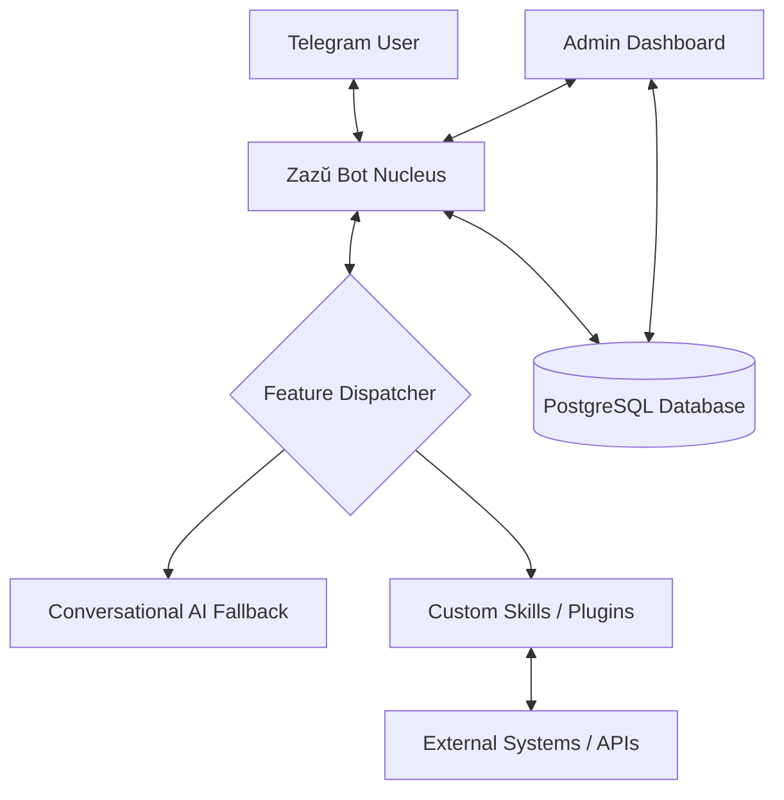

# Zazŭ: Personal & Business Intelligence Orchestrator

Zazŭ is a modular "Nuclear Engine" for Telegram-based automation. It acts as a lightweight communication proxy that routes interactions to specific specialized "Skills" while maintaining a unified conversational interface and high-fidelity interaction logs.

---

## 🚀 Key Features

- **Nuclear Core**: Lightweight Telegram routing with built-in persistence for all messages.
- **Onboarding Flow**: Automatic Chat ID capture and interactive name registration.
- **Conversational Fallback**: Intelligent, low-token conversational AI (GPT-4o-mini) in Spanish.
- **Modular Skills**: A plug-and-play architecture for specific user-based automations (Voice transcription, CRM logging, External API hooks).
- **Admin Dashboard**: Sleek interface for user management, feature toggling, and manual broadcasts.

---

## 🛠️ Technology Stack

- **Framework**: Node.js (TypeScript)
- **Bot Library**: Telegraf.js
- **Database**: PostgreSQL with Prisma ORM
- **AI Models**: OpenAI GPT-4o-mini
- **Frontend**: Next.js + Tailwind CSS + Shadcn UI
- **Infrastructure**: Docker Compose

---

## 🗺️ Architecture Overview



---

## ⚡ Quick Start

### Prerequisites
- Node.js >= 20.0.0
- Docker & Docker Compose
- Telegram Bot Token

### Installation

1.  **Clone the Repository**
    ```bash
    git clone git@github.com:samuelaure/zazu.git
    cd zazu
    ```

2.  **Environment Setup**
    Copy `.env.example` and fill in your credentials.
    ```bash
    cp .env.example .env
    ```

3.  **Run with Docker**
    ```bash
    docker-compose up -d
    ```

4.  **Local Development**
    ```bash
    npm install
    npm run dev:bot
    ```

---

## 📝 License
Proprietary. All rights reserved by Samuel Aure.
